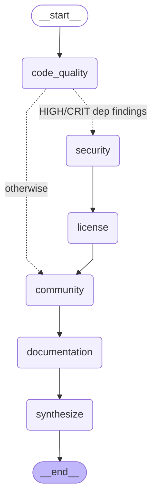

# Architecture Decentralized — handoffs Command(goto=...), 0 superviseur LLM

> **Note** : Le routage `Command(goto=...)` est dynamique — invisible au `draw_mermaid()` statique.
> Ce diagramme est reconstruit manuellement depuis les règles `_ROUTING_RULES` dans `decentralized.py`.

