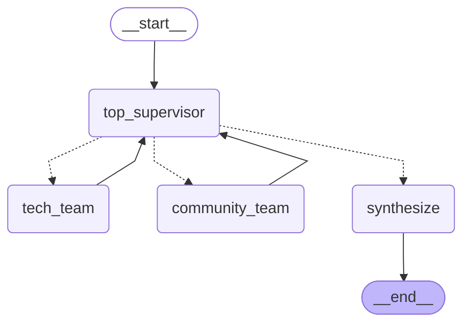

# Architecture Hierarchical — graphe parent (3 niveaux de supervision LLM)

> Généré par `experiments/generate_diagrams.py`

```mermaid
---
config:
  flowchart:
    curve: linear
---
graph TD;
	__start__([<p>__start__</p>]):::first
	top_supervisor(top_supervisor)
	tech_team(tech_team)
	community_team(community_team)
	synthesize(synthesize)
	__end__([<p>__end__</p>]):::last
	__start__ --> top_supervisor;
	community_team --> top_supervisor;
	tech_team --> top_supervisor;
	top_supervisor -.-> community_team;
	top_supervisor -.-> synthesize;
	top_supervisor -.-> tech_team;
	synthesize --> __end__;
	classDef default fill:#f2f0ff,line-height:1.2
	classDef first fill-opacity:0
	classDef last fill:#bfb6fc

```
