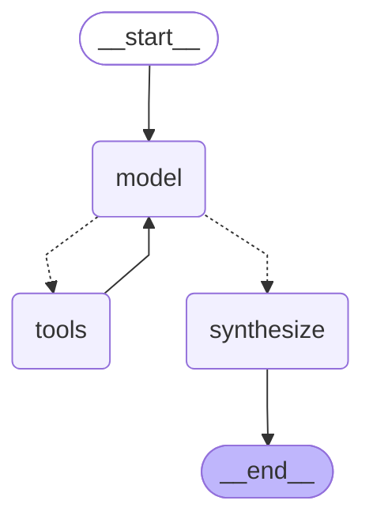

# Boucle ReAct — BaseAuditAgent (partagée par les 5 agents spécialisés)

> Généré par `experiments/generate_diagrams.py`

```mermaid
---
config:
  flowchart:
    curve: linear
---
graph TD;
	__start__([<p>__start__</p>]):::first
	model(model)
	tools(tools)
	synthesize(synthesize)
	__end__([<p>__end__</p>]):::last
	__start__ --> model;
	model -.-> synthesize;
	model -.-> tools;
	tools --> model;
	synthesize --> __end__;
	classDef default fill:#f2f0ff,line-height:1.2
	classDef first fill-opacity:0
	classDef last fill:#bfb6fc

```
