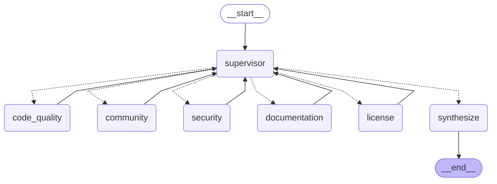

# Architecture Supervisor — LLM orchestrateur séquentiel (1 superviseur LLM)

> Généré par `experiments/generate_diagrams.py`

```mermaid
---
config:
  flowchart:
    curve: linear
---
graph TD;
	__start__([<p>__start__</p>]):::first
	supervisor(supervisor)
	code_quality(code_quality)
	community(community)
	security(security)
	documentation(documentation)
	license(license)
	synthesize(synthesize)
	__end__([<p>__end__</p>]):::last
	__start__ --> supervisor;
	code_quality --> supervisor;
	community --> supervisor;
	documentation --> supervisor;
	license --> supervisor;
	security --> supervisor;
	supervisor -.-> code_quality;
	supervisor -.-> community;
	supervisor -.-> documentation;
	supervisor -.-> license;
	supervisor -.-> security;
	supervisor -.-> synthesize;
	synthesize --> __end__;
	classDef default fill:#f2f0ff,line-height:1.2
	classDef first fill-opacity:0
	classDef last fill:#bfb6fc

```
